# MLOps model governance backend

A small, testable backend for governing ML models: a model registry with stage transitions,
a versioned policy layer, audit hash chain, incident lifecycle, drift checks, dataset and
lineage tracking, and an optional MLflow mirror. Python 3.12, FastAPI, SQLite (Alembic
migrations), pytest.

## Try it (terminal only)

```bash
pip install -r requirements.txt
PYTHONPATH=exec python3 -m mlops.demo        # end-to-end walk through the real app, prints every response
PYTHONPATH=exec python3 -m mlops.svc --check # build the real wiring and exit
PYTHONPATH=exec python3 -m mlops.svc --port 8000   # serve
PYTHONPATH=exec python3 -m pytest tests -q   # full suite (about 9 minutes)
```

`mlops.demo` registers a model, publishes and evaluates a scoped policy, lints a manifest,
checks drift, opens and escalates an incident, verifies the audit chain, builds and
self-validates an SBOM, and queries lineage. It uses the same `build_default_wiring` that
`python -m mlops.svc` uses, with no mocks.

## Layout

| Path | What is there |
|---|---|
| `exec/mlops/svc/` | FastAPI service: `app.py` (routes and `build_default_wiring`), settings, CLI, SDK, routers, background workers |
| `exec/mlops/policy_engine.py`, `policy_store.py` | Policy layer: rule evaluation, versioned bundles, loosening guard, decision log, replay |
| `exec/mlops/model_stages.py`, `incidents.py`, `drift.py`, `lineage.py`, `dataset_versions.py` | Registry stages, incidents, drift monitors, lineage graph, dataset registry |
| `exec/mlops/audit.py`, `sqldb*.py`, `migrations/` | Audit chain and SQLite persistence |
| `exec/mlops/interop/` | MLflow bridge (opt-in mirror) |
| `exec/mlops/legacy/` | Project 1 modules kept as a stdlib-only regression baseline, isolated from the live service |
| `tests/` | Test suites; `tests/oracle/` holds the casbin reference used only by tests |
| `docs/` | `POLICY-CONTRACT.md`, `TECHNICAL-REQUIREMENTS.md`, `diagrams/`, `LIVE-TEST-JOURNEY.md`, `RESEARCH-NOTES.md` |
| `live_tests/` | End-to-end scenario harness, six real-dataset trainers, EDA and post-training statistics pipeline — see below |

## Policy layer

The raw Python layer is the only runtime decision maker. A decision is over
(action, resource, context); rules are one of eight kinds (`min_metric`, `max_metric`,
`flag_true`, `flag_false`, `status_equals`, `budget_ok`, `role_in`, `no_nan`) and may be
scoped to an `action` and `resource` with casbin `keyMatch` patterns (`*`, `prefix*`).
Every applicable block rule must pass, warn rules never block, an empty bundle denies, and
anything malformed fails closed. Loosening a policy needs `human_approved_by`.
Full contract: [docs/POLICY-CONTRACT.md](docs/POLICY-CONTRACT.md).

casbin is not part of the server. It is a test-time oracle: `tests/test_policy_vs_casbin_oracle.py`
re-expresses the contract in casbin's matcher language and requires the raw layer to agree
on 10,800 seeded random decisions (3 seeds x 3,600) and on each rule's verdict, and shows the comparison detects
three deliberately broken engines.

The active policy gates production transitions and rollback in the running service (on by
default; with no active policy they are denied). See the contract's Enforcement section.

## Status and known gaps

- The drift worker re-checks a fixed window; there is no ingestion endpoint yet.
- Policy versions persist across restarts; incidents (`OpsRepo.upsert_incident` is never called) and drift baselines (never reloaded) do not. The policy decision log and rollback target are in memory.
- The lineage graph is in memory; the MLflow mirror swallows errors by design (best effort).
- Diagrams: [docs/diagrams/](docs/diagrams/) (12 boards, source files plus a README index).

## Live-test pipeline: results and evidence

`live_tests/` drives the real service above, entirely through its HTTP API, across three scenarios
and six real datasets — no mocks, nothing reached behind the interface. Four cross-scenario defect
classes were found by direct reproduction and closed with real re-measured evidence (a drift-check
crash on any real shift, a self-attested-metric bypass of the policy gate, a durable-store/
in-memory disagreement after rollback, and an unretrievable worker-persisted value). Full write-up:
[docs/LIVE-TEST-JOURNEY.md](docs/LIVE-TEST-JOURNEY.md).

### Papers

Eleven papers ground the non-obvious design decisions below; full citations and what each one
motivated (or explicitly does *not* support) are in
[docs/RESEARCH-NOTES.md](docs/RESEARCH-NOTES.md).

- Kim et al., *TabReD: A Benchmark of Tabular Machine Learning in the Wild*,
  [arXiv:2406.19380](https://arxiv.org/abs/2406.19380) — random splits on temporally-ordered
  tabular data leak; every trainer here splits by time/order instead.
- März, Kneib, *Distributional Gradient Boosting Machines*,
  [arXiv:2204.00778](https://arxiv.org/abs/2204.00778) — a fuller distributional alternative to the
  plain-residual and three-quantile diagnostics used here.
- Mayer, *SHAP for additively modeled features in a boosted trees model*,
  [arXiv:2207.14490](https://arxiv.org/abs/2207.14490) — SHAP-vs-partial-dependence equivalence
  holds only for depth-1/additive trees, not the depth 6-8 models trained here.
- Liu, *The Hidden Cost of Resampling: How Imbalance Correction Degrades Probability Calibration in
  Tree Ensembles*, arXiv:2606.29720 — why the fraud classifier's calibration curve is paired with
  numeric ECE and Brier score.
- Gauthier-Melançon et al., *Azimuth: Systematic Error Analysis for Text Classification*,
  [arXiv:2212.08216](https://arxiv.org/abs/2212.08216) — the saliency technique behind the AG News
  token-saliency chart below.

### Key results

Real held-out numbers from the six trainers, gated by the policy layer above on the test column:

| Dataset | Metric | Train | Test | Test rows |
|---|---|---|---|---|
| Fraud (binary, 0.17% positive) | AUPRC | 0.7207 | 0.3920¹ | 85,443 |
| AG News (4-class text) | macro-F1 | 0.9110 | 0.9249 | 3,800 |
| Taxi tip amount (regression) | MAE | 0.8925 | 0.8875 | 2,051,233 |
| Jena temperature (regression) | MAE | 2.5219 | 3.1598 | 126,166 |
| Covertype (7-class, elevation-split) | macro-F1 | 0.6458 | 0.2822¹ | 174,304 |
| EuroSAT (10-class images) | macro-F1 | 0.4318 | 0.3989 | 4,860 |

¹ These are the **deployed trainer's** numbers (`live_tests/train.py`, unchanged) — the same
functions the three live-test scenarios and the policy layer above exercise. A separate
benchmarking investigation (not a change to the deployed trainer) reaches materially better
numbers for these three specific models — see directly below.

### Improvement experiments (most recent results)

Three of the six models above (fraud, covertype, EuroSAT) were investigated further and improved
through a history of experiments — hyperparameter tuning, ensemble resampling, a
literature-inspired binary reduction with a swept weight parameter, and (for EuroSAT) a full CNN
reproduction with in-training and post-training diagnostics. These are separate benchmarking
trainers, not changes to the deployed pipeline above. Full history, all intermediate stages, and
every figure: [legacy/README.md](legacy/README.md). Most recent results only, below:

| Dataset | What changed | Metric | Before | After |
|---|---|---|---|---|
| Fraud | `class_weight="balanced"` + validated depth | Test AUPRC | 0.3920 | **0.7203** (+84%, at a real calibration cost — see legacy/) |
| Covertype | `class_weight="balanced"` + validated depth (10) | Test macro-F1 | 0.2822 | **0.4051** (+43.6%) |
| Covertype | Binary Krummholz-vs-rest + swept class weight (w=20) | Krummholz recall | 0.0173 | **0.1349** (+680%, a separate experiment — the two Covertype rows are not sequential, see legacy/) |
| EuroSAT | Baseline CNN vs. deployed PCA(50)+LogReg | Test macro-F1 | 0.3989 | **0.9536** (+139%, well-converged, 30 epochs) |
| EuroSAT | Balanced-attention CNN (CoordAttn+SE), 17 epochs | Test macro-F1 | 0.3989 | 0.5522 (under-converged — reported as-is, currently *below* the simpler baseline CNN above, not cherry-picked) |

| | |
|---|---|
| 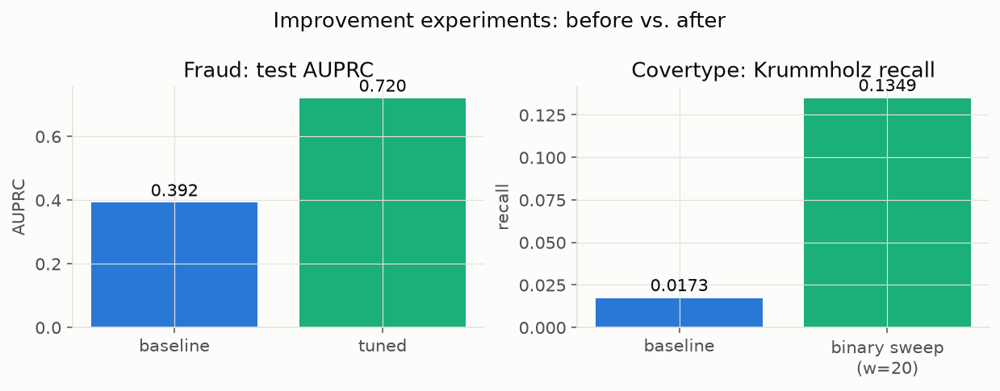<br><sub>All three headline improvements side by side — fraud's AUPRC gain, covertype's aggregate macro-F1 gain, and covertype's Krummholz-recall gain (the latter two are separate, non-sequential experiments).</sub> | 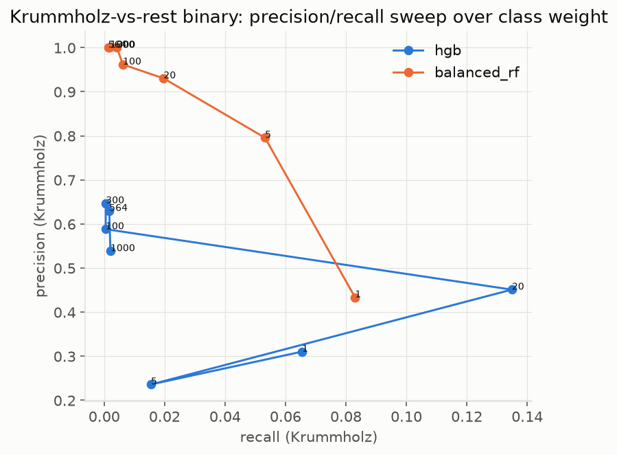<br><sub>Binary Krummholz-vs-rest classifier, class weight swept 1-1000. `class_weight="balanced"`'s own implied ratio (~564) lands at one of the *worst* points on this curve — the actual optimum (w=20) is only visible by sweeping.</sub> |
| <br><sub>Fraud's calibration curve after the AUPRC-improving retune — ECE rose from 0.0019 to 0.0896, the real cost of the discrimination gain above.</sub> | 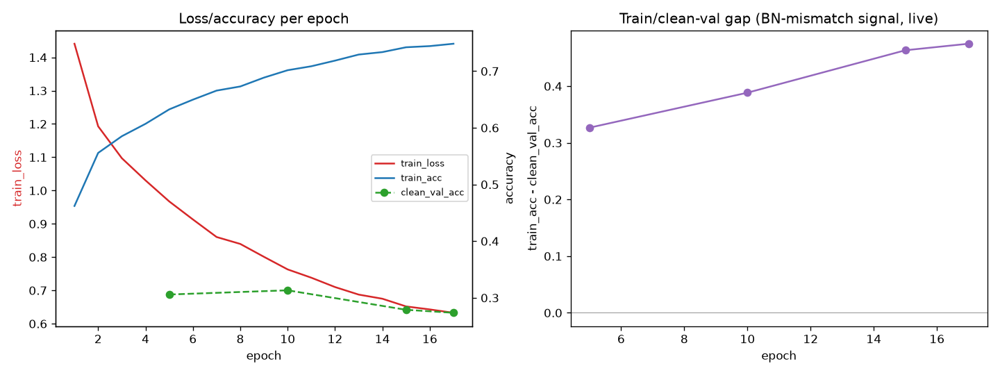<br><sub>Loss/accuracy per epoch plus the train/clean-validation gap widening live (0.33→0.47) — the same BatchNorm/heavy-augmentation mismatch from the baseline incident, this time caught mid-training by the rebuilt diagnostics instead of only after.</sub> |
| <br><sub>3 raw weight scalars plotted as a 3D path over ~4,500 training steps, colored by time — a paper-faithful reproduction of TensorView's actual mechanism, not a summary statistic.</sub> | |

Covertype's honest train/test gap is the point of that scenario: an elevation-ordered split is a
genuine, severe distribution shift (see the figure below), and the policy layer correctly denies
promotion on the real number rather than a flattering one.

**Hardware used (EuroSAT CNN training):** NVIDIA Tesla T4 and NVIDIA L4, both via Google Colab —
no local CUDA available in this environment. The final 17-epoch attention-model run measured 247s
(4.1 min) training + 9.4s BatchNorm recalibration on an L4. All 5 model checkpoints:
[shared Google Drive folder](https://drive.google.com/drive/folders/1onzEVzL6x5wMEhrklJMoWm7QOW8NssTd?usp=sharing)
(not committed here — no Git LFS in this repo). Full write-up, both models' code, and raw
statistics: [legacy/README.md](legacy/README.md).

### EuroSAT: post-training interpretability

| | |
|---|---|
| 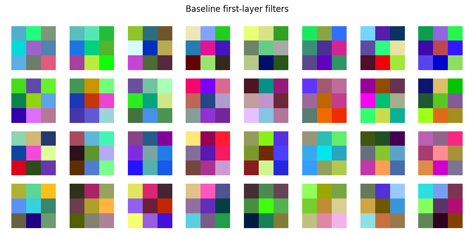<br><sub>Every learned 3x3 first-conv filter as an RGB patch. Correctly rendered, but a real limitation found by inspection: a 3x3 kernel is too small to show the edge-detector structure Zeiler & Fergus's own diagnostic (built on AlexNet's 11x11 filters) depends on — see RESEARCH-NOTES.md for the full correction.</sub> | <br><sub>Per-layer weight distributions — the architecture-appropriate health check for a 3x3-kernel network (no collapsed/saturated layers).</sub> |
| <br><sub>Same visualization, attention model's stem layer.</sub> | <br><sub>Attention model's per-layer weight distributions, post BN-recalibration.</sub> |
| <br><sub>Grad-CAM, 2 examples per class (AnnualCrop-Industrial). Caveat: 64x64 input gives an 8x8 last-conv feature map, smaller than anything validated in the original Grad-CAM paper (7x14x14 on 224x224) — an honest extrapolation.</sub> | 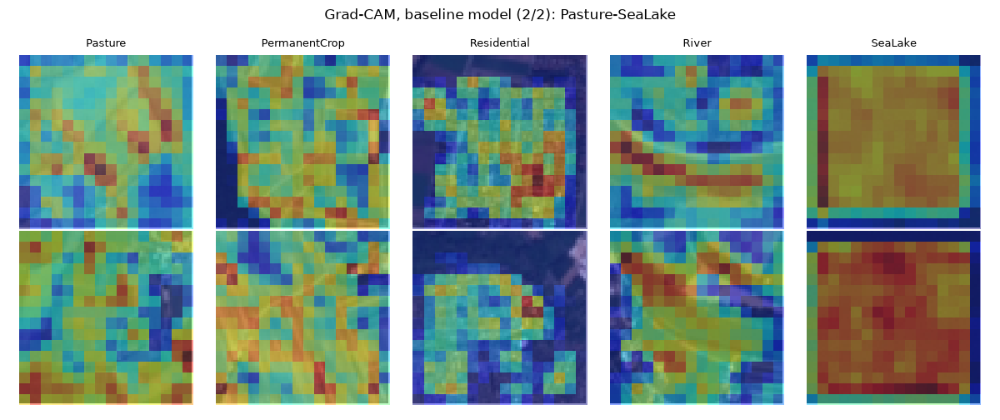<br><sub>Grad-CAM, 2 examples per class (Pasture-SeaLake), same caveat as above.</sub> |
| 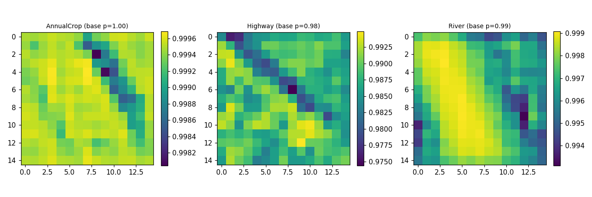<br><sub>Zeiler & Fergus-style causal check — predicted-class probability as a grey patch sweeps the image.</sub> | |

### EuroSAT: dataset understanding (independent of any trained model)

| | |
|---|---|
| <br><sub>Per-class mean image — the typical visual signature per class, independent of any one example.</sub> | <br><sub>PCA(2) on raw normalized pixels — the same feature representation the deployed PCA+LogReg baseline uses, before any CNN touches the data.</sub> |
| <br><sub>Top-3 most-confused class pairs on the attention model's confusion matrix (top: Forest/SeaLake, 771 confusions) — differs from the reproduction paper's own most-confused pair, most plausibly an under-convergence artifact given the attention model's macro-F1 (0.55) vs. the baseline's (0.95), reported honestly rather than presented as a literature match.</sub> | |

### Figures

One data-understanding chart and one post-training diagnostic per dataset (12 figures in the table
below), plus the 15 improvement-experiment figures above (5 fraud/covertype/EuroSAT-summary
figures, plus the full EuroSAT post-training-interpretability and dataset-understanding galleries)
— the full run also produces per-class metrics, permutation importance, and training curves for
every model (see `docs/RESEARCH-NOTES.md` and `live_tests/stats.py`).

| | |
|---|---|
| 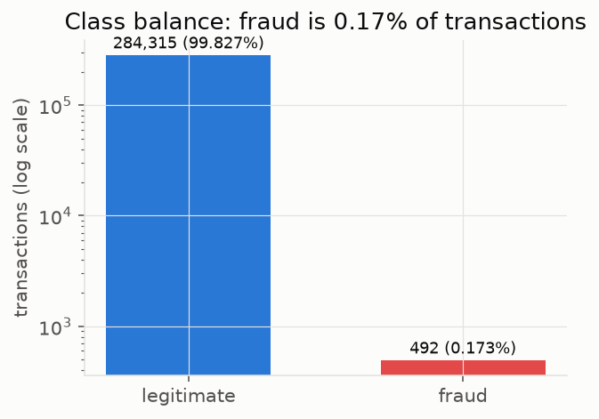<br><sub>Fraud is 0.17% of transactions (log scale) — why AUPRC, not accuracy, gates promotion.</sub> | 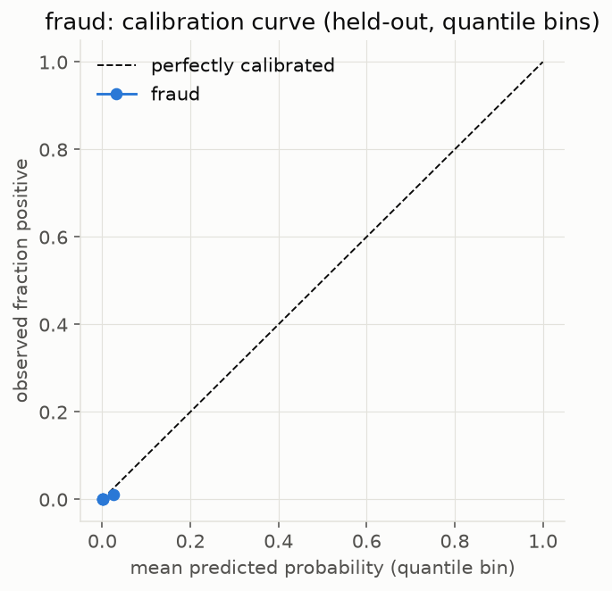<br><sub>Quantile-binned calibration curve with ECE and Brier score, paired per the resampling-calibration paper above.</sub> |
| 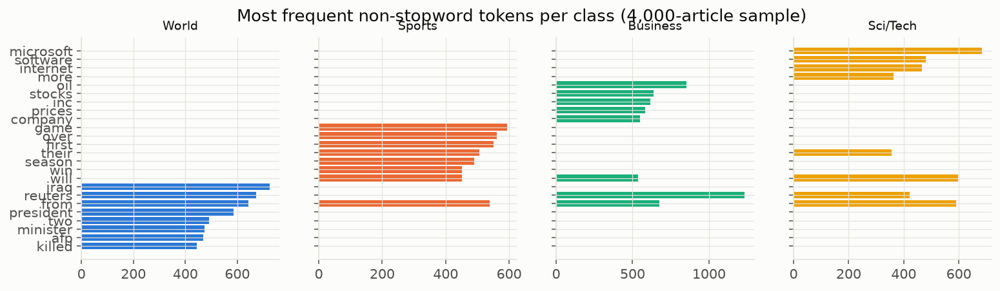<br><sub>Top non-stopword tokens per class — the vocabulary signal a TF-IDF classifier relies on.</sub> | 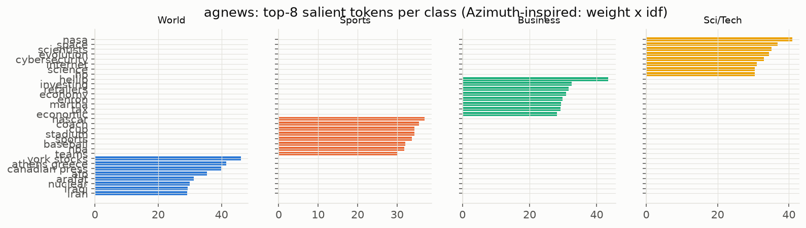<br><sub>Azimuth-inspired per-class token saliency (coefficient x IDF).</sub> |
| 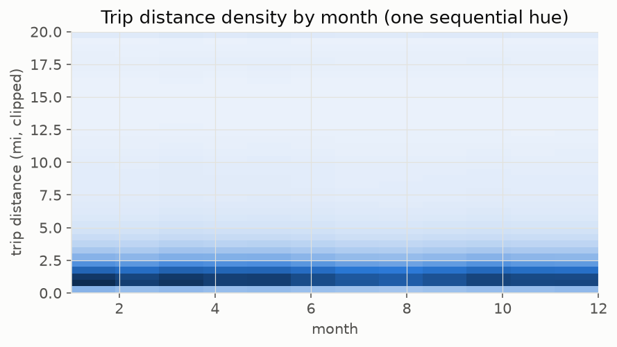<br><sub>Trip-distance density across the year, single sequential hue for magnitude.</sub> | 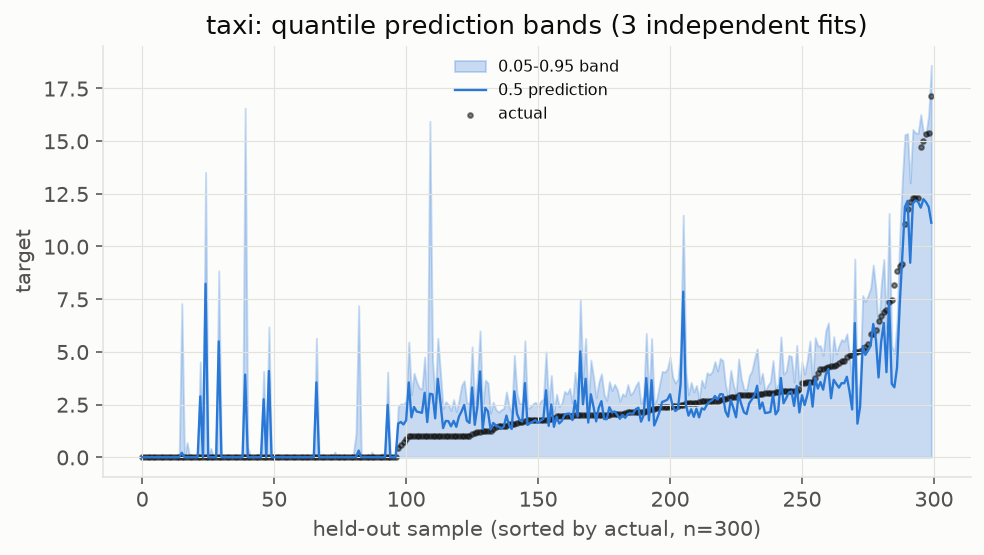<br><sub>5th/50th/95th percentile prediction bands from three independent quantile-loss fits.</sub> |
| 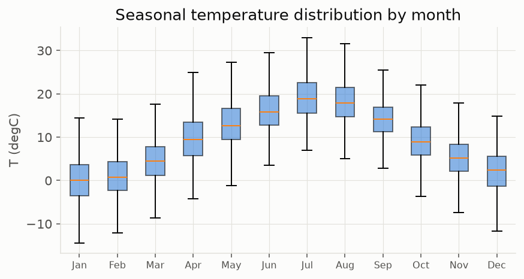<br><sub>Month-by-month temperature spread — the real seasonal shift used for the January-vs-July drift check.</sub> | 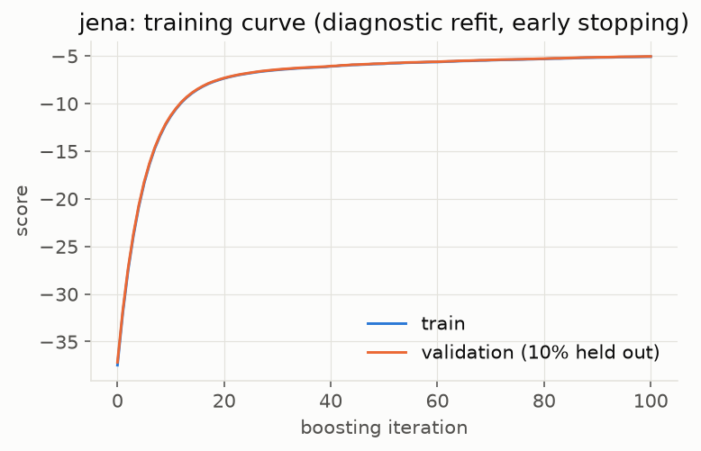<br><sub>Diagnostic early-stopped training curve (train/validation score per boosting iteration).</sub> |
| 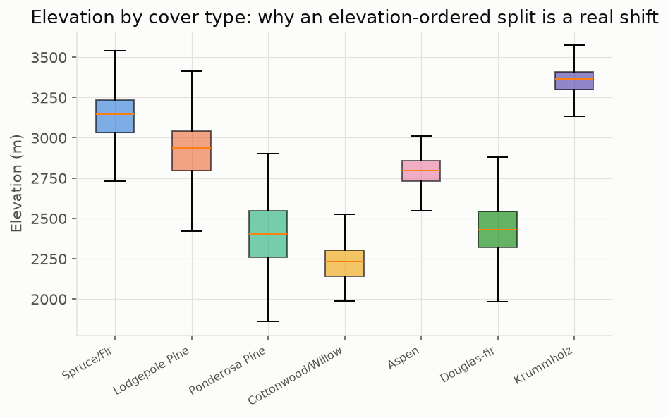<br><sub>Elevation distribution per cover type — why an elevation-ordered split is a genuine shift, not an arbitrary one.</sub> | 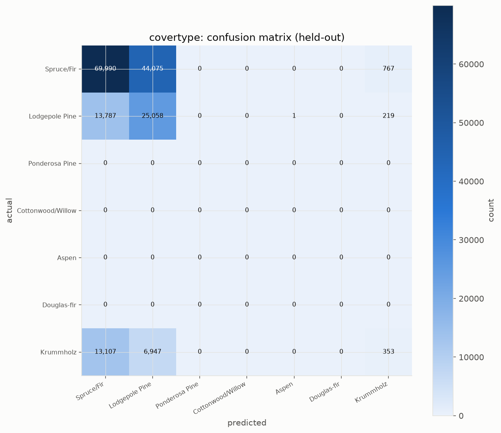<br><sub>Held-out confusion matrix, 7 classes, on the honestly denied (0.2822 macro-F1) model.</sub> |
| 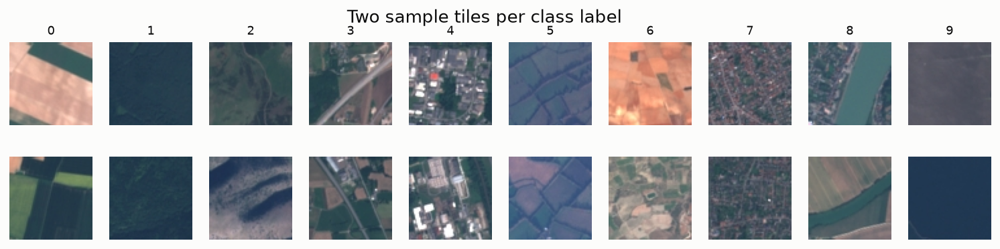<br><sub>Two real 64x64 tiles per class — what the classifier actually sees.</sub> | 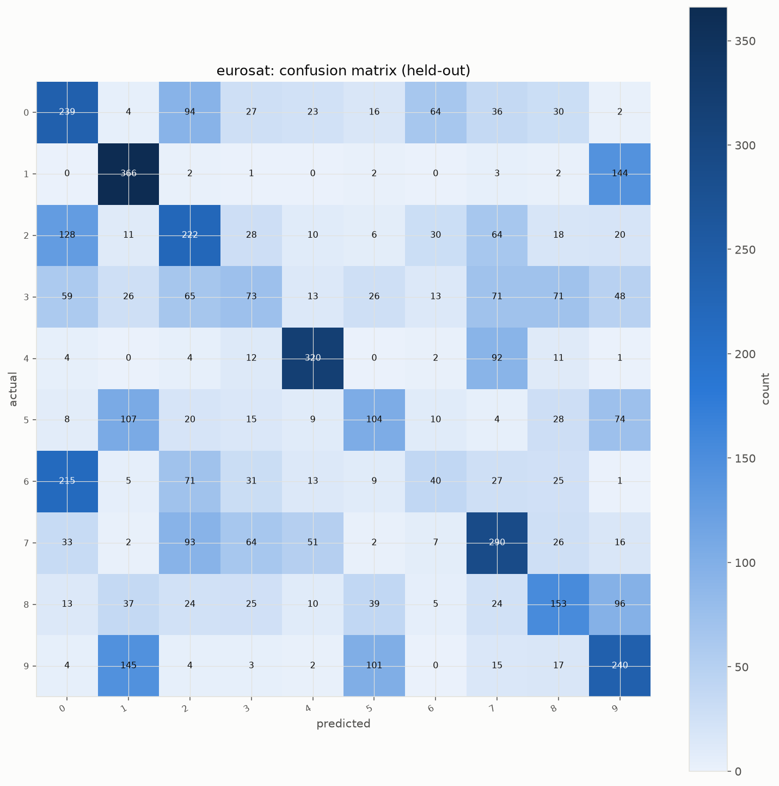<br><sub>Held-out confusion matrix, 10 classes, PCA(50) + logistic regression.</sub> |

<details>
<summary>Layout &amp; running it</summary>

```
live_tests/
├── harness.py            # real subprocess + SQLite harness, classified step outcomes
├── train.py               # one real trainer per dataset, time-forward split
├── eda.py                 # 22 data-understanding charts + persisted numeric stats.json/STATS.md
├── stats.py               # post-training statistics: confusion matrices, calibration, training
│                          #   curves, permutation importance, quantile bands, token saliency
├── collect_stats.py        # drives eda.py + train.py + stats.py per dataset, writes RUN_SUMMARY
├── sampling.py, prepare_data.py, verify_components.py
├── scenarios/              # the three end-to-end scenario drivers
└── tests/                  # unit tests for the harness and sampler
```

```bash
# prepare the six datasets into <data dir>/datasets/<name>/ first (raw sources are not in this repo)
PYTHONPATH=. python3 -m live_tests.collect_stats --data <data dir> --out <output dir> \
  --only fraud agnews taxi jena covertype eurosat
```

</details>
