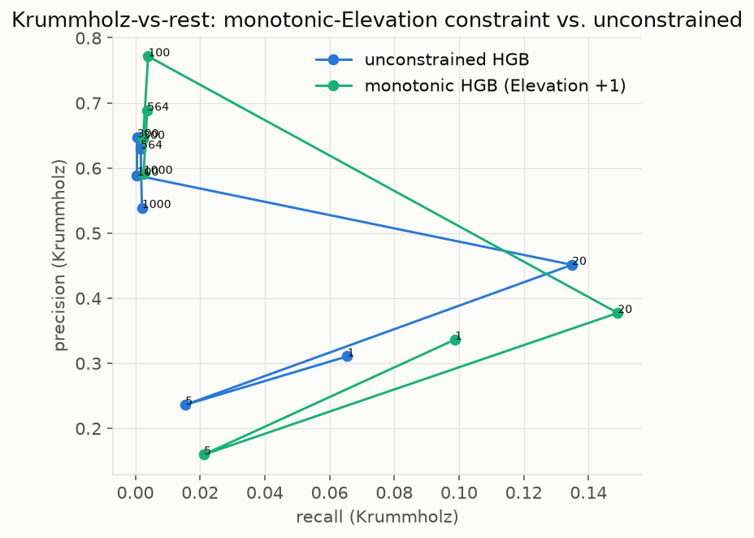

# Improvement-experiment history

Three stages of investigating and improving the two weakest-scoring models from the live-test
statistics pass (`fraud` and `covertype` — see the main [README](../README.md) and
[docs/RESEARCH-NOTES.md](../docs/RESEARCH-NOTES.md)). Each stage's code is preserved unmodified:
[`improve_legacy.py`](improve_legacy.py) (stage 1), [`improve_legacy2.py`](improve_legacy2.py)
(stage 2), [`improve_current.py`](improve_current.py) (stage 3, current). None of the three
touches the original live-test trainers — every number here is a separate benchmarking experiment,
not a change to the deployed pipeline.

## Stage 1 (`improve_legacy.py`) — hyperparameter tuning + class weighting

**Fraud**: `class_weight="balanced"` + a validated `max_depth` sweep (time-forward
train/validation/test, validation carved from the end of the train window only).

| Metric | Baseline | Tuned |
|---|---|---|
| Test AUPRC | 0.3920 | **0.7203** |
| ECE | 0.0019 | 0.0896 (47x worse) |
| Brier score | 0.0012 | 0.0096 (8x worse) |

| Baseline calibration | Tuned calibration |
|---|---|
|  |  |

A real, large AUPRC gain, at a real, disclosed calibration cost (Liu et al. 2026's exact predicted
tradeoff for resampling/reweighting under severe imbalance — cited in RESEARCH-NOTES.md).

**Covertype**: same `class_weight="balanced"` approach, `max_depth` validated the same way.

| Metric | Baseline | Tuned |
|---|---|---|
| Test macro-F1 | 0.2822 | **0.4051** |
| Krummholz recall | 0.0173 | 0.0015 (worse) |
| Krummholz precision | 0.264 | 0.969 |

| Baseline confusion matrix | Tuned confusion matrix |
|---|---|
|  |  |

The aggregate metric improved by getting better at the classes with full train/test elevation
overlap — Krummholz (zero overlap between its 103 training rows and 20,407 test rows) got *worse*,
not better, as the model became more conservative overall.

## Stage 2 (`improve_legacy2.py`) — ensemble resampling (CLIMB-inspired)

CLIMB (arXiv:2505.17451, NeurIPS 2025) shows ensemble-resampling methods sometimes beat plain
gradient boosting by large margins on hard multiclass problems, via a different mechanism than
class weighting (each tree's bootstrap sample is itself rebalanced). Tested
`imblearn.ensemble.BalancedRandomForestClassifier` on Covertype:

| Metric | Baseline | Tuned (stage 1) | Balanced-RF ensemble |
|---|---|---|---|
| Test macro-F1 | 0.2822 | 0.4051 | 0.2994 |
| Krummholz recall | 0.0173 | 0.0015 | **0.0834** |
| Krummholz F1 | 0.032 | 0.003 | **0.143** |

The first method that made real progress on Krummholz specifically — a genuine tradeoff against
stage 1's aggregate-optimizing result, not a strict improvement on it.

## Stage 3 (`improve_current.py`) — Britsch-inspired binary reduction + weight sweep

Britsch, Gagunashvili & Schmelling (arXiv:1011.6224) is the one paper confirmed to use the real
UCI Covertype dataset (Cottonwood/Willow as a binary "signal" class). Their central technique
(more majority data + SMOTE, under a random split) doesn't transfer — their paper explicitly
assumes full train/test feature overlap, which Krummholz does not have. Two structural ideas *do*
transfer: collapsing to one-vs-rest binary (concentrating model capacity), and scanning a cost/
weight parameter to trace a full precision/recall frontier rather than trusting one heuristic
choice.

| Weight | HGB recall | HGB precision | HGB F1 |
|---|---|---|---|
| 1 | 0.065 | 0.310 | 0.108 |
| 5 | 0.015 | 0.236 | 0.029 |
| **20** | **0.135** | **0.451** | **0.208** |
| 100 | 0.0005 | 0.588 | 0.001 |
| 300 | 0.001 | 0.647 | 0.001 |
| 564 (`class_weight="balanced"`'s own ratio) | 0.0017 | 0.630 | 0.003 |
| 1000 | 0.0021 | 0.538 | 0.004 |

The same sweep, run against `BalancedRandomForestClassifier` (stage 2's bagging/undersampling
mechanism) instead of `HistGradientBoosting`, on the same binary Krummholz-vs-rest reduction:

| Weight | BalancedRF recall | BalancedRF precision | BalancedRF F1 |
|---|---|---|---|
| **1** | **0.083** | 0.434 | 0.139 |
| 5 | 0.053 | 0.796 | 0.100 |
| 20 | 0.020 | 0.930 | 0.038 |
| 100 | 0.006 | 0.962 | 0.012 |
| 300 | 0.004 | 1.000 | 0.008 |
| 564 | 0.001 | 1.000 | 0.003 |
| 1000 | 0.002 | 1.000 | 0.004 |

**The best Krummholz result across every method tried** — 7.8x the baseline recall — found only
by sweeping the weight parameter rather than using `class_weight="balanced"` directly, which lands
at one of the *worst* points in the same sweep. That win is specific to the boosting mechanism:
BalancedRF's own best recall under the same binary reduction (0.083 at w=1) exactly ties its
*multiclass* ensemble recall already reported in stage 2 (0.0834) — i.e. binary reduction did
nothing for the bagging/undersampling mechanism, and increasing BalancedRF's weight only drove its
precision toward 1.000 while collapsing recall toward zero. Capacity concentration via binary
reduction helped boosting specifically, not resampling-based bagging in general. Full sweep data
(both families, 7 weights each, val + test splits) is `../krummholz_binary_sweep.json` (raw JSON,
not curated); see [docs/RESEARCH-NOTES.md](../docs/RESEARCH-NOTES.md) for the honest caveat that
validation-based weight selection is itself uninformative for this class (the val window recreates
the same zero-overlap problem one level down between train and validation).

## Stage 4 (`improve_legacy4.py`) — monotonic Elevation constraint on the Krummholz binary

Krummholz's defining problem is extrapolation, not imbalance: its 103 training rows all sit at
2868-3128m while every test row sits at >=3129m. A monotonic constraint targets that directly —
Krummholz is ecologically an above-treeline cover type, so "higher Elevation must not *decrease*
P(Krummholz)" is a defensible domain constraint, and it gives the model a defined behaviour
beyond its training range instead of flat extrapolation. Implemented with sklearn
`HistGradientBoostingClassifier(monotonic_cst=...)`, +1 on Elevation only, over stage 3's same
weight sweep.

| Weight | Recall (unconstrained) | Recall (monotone) | Precision (uncon.) | Precision (mono.) | F1 (uncon.) | F1 (mono.) |
|---|---|---|---|---|---|---|
| 1 | 0.0655 | 0.0987 | 0.3104 | 0.3361 | 0.1081 | 0.1526 |
| 5 | 0.0155 | 0.0212 | 0.2360 | 0.1595 | 0.0291 | 0.0375 |
| **20** | **0.1349** | **0.1490** | **0.4511** | **0.3771** | **0.2077** | **0.2136** |
| 100 | 0.0005 | 0.0040 | 0.5882 | 0.7714 | 0.0010 | 0.0079 |
| 300 | 0.0005 | 0.0024 | 0.6471 | 0.6447 | 0.0011 | 0.0048 |
| 564 | 0.0017 | 0.0037 | 0.6296 | 0.6881 | 0.0033 | 0.0073 |
| 1000 | 0.0021 | 0.0025 | 0.5385 | 0.5909 | 0.0041 | 0.0051 |

Recall improves at **all 7 weights** — a consistent directional effect, not noise. At w=20 (the
best operating point for both variants) recall goes 0.1349 → **0.1490** (+10.5% relative) and F1
0.2077 → 0.2136 (+2.8%), at a real precision cost (0.4511 → 0.3771, −16.4%). The large relative
gains at weights ≥100 are not practically meaningful — both variants are already collapsed to
<1% recall there.

Grounding caveat: Koklev 2026 ([arXiv:2512.17945](https://arxiv.org/abs/2512.17945)) supplied the
*mechanism* and the constraint-selection protocol, but all five of its datasets are binary
credit-PD problems — it never tests elevation extrapolation or Covertype. The effect above was
measured here, not inherited from the citation.

## Stage 5 (`improve_legacy4.py`) — capacity sweep, and a silent early-stopping defect

Stage 1 tuned only `max_depth`, leaving `max_iter` and `learning_rate` untouched. Sweeping them
surfaced something more important than either: **sklearn auto-enables early stopping above 10,000
samples**, so on this 345,701-row training window a model asked for `max_iter=600` actually trains
**57 iterations** (verified via `n_iter_`; 7.3s vs 62.8s wall for the same nominal setting). Every
prior Covertype stage — the deployed trainer and stage 1's sweep included — was silently capped at
~57 rounds. Worse for this protocol specifically, early stopping picks its cutoff on an internal
**random** validation subset, drawn from the same elevation band as training, so it is blind to the
shifted window whose capacity it is implicitly setting.

Three conditions, each isolating one variable:

| Condition | Split | Weighting | Test accuracy | Test macro-F1 |
|---|---|---|---|---|
| Deployed protocol | Elevation-ordered | balanced | 0.6510 | **0.4095** |
| Control (split isolated) | Random | balanced | **0.9241** | **0.9113** |
| Control (weighting isolated) | Random | none | 0.8372 | 0.7649 |

**The trainer is competent; the protocol is the cost.** On a conventional random split this same
code reaches **92.4% accuracy**, within ~2-3 pp of the ~94-95.5% modern published Covertype
baselines. The elevation-ordered split costs **27.3 pp of accuracy** (0.924 → 0.651) with weighting
held constant. For external corroboration that this magnitude is expected on this dataset,
[arXiv:2601.00908](https://arxiv.org/abs/2601.00908) reports Covertype collapsing **81.8 pp** under
a distribution-shift split across 10/10 seeds while 6 other datasets stayed robust — though their
shift is *wilderness-area* based, not elevation-ordered, so it corroborates the magnitude without
being the identical protocol.

Disabling early stopping lifted elevation-split **validation** macro-F1 0.3034 → 0.4535, but test
macro-F1 only 0.4051 → **0.4095**. That gap is the honest result: the validation gain did not
transfer to the shifted test set.

Two caveats worth stating rather than burying: the two control rows ran a **single untuned config**
(`lr=0.1`) while the elevation condition found `lr=0.05` markedly better, so the
balanced-vs-unweighted comparison is confounded with tuning depth and is not a clean result.

## Stage 6 (`improve_current.py`) — the three libraries the monotonicity paper actually benchmarks

Stage 4 cited a paper benchmarking **XGBoost, LightGBM and CatBoost** but implemented its
constraint in sklearn's HGB — which is none of them. Across every prior stage this project had only
ever used `HistGradientBoostingClassifier` and `BalancedRandomForestClassifier`. Stage 6 closes
that gap: same Krummholz binary task, same elevation split, same `scale_pos_weight=20`, identical
`n_estimators`/`max_depth`/`learning_rate`/seed across all three libraries (the paper's own
"comparable base configurations" protocol), scored with the paper's own Price of Monotonicity
(PoM = (uncon − mono)/uncon × 100; positive = cost, negative = benefit).

| Library | Recall (uncon.) | Recall (mono.) | Precision (uncon.) | Precision (mono.) | Recall PoM |
|---|---|---|---|---|---|
| sklearn HGB (stage 4 reference) | 0.1349 | **0.1490** | 0.4511 | 0.3771 | −10.5% |
| XGBoost 3.4.1 | 0.0025 | 0.0018 | 0.7286 | 0.6429 | +29.4% |
| LightGBM 4.7.0 | 0.0033 | 0.0528 | 0.1511 | 0.0820 | −1483.8% |
| CatBoost 1.2.10 | 0.0204 | 0.0110 | 0.8761 | 0.8682 | +46.3% |

**All three lost to sklearn.** The best library result (LightGBM monotone, 0.0528 recall) is still
2.8× worse than sklearn's 0.1490. The likely mechanism is the stage-5 discovery in reverse: these
libraries do not early-stop without an `eval_set`, so they trained all 600 rounds, while sklearn
HGB silently stopped near 57 — and **under covariate shift that accidental underfitting was
protective**, since more capacity means a tighter fit to the low-elevation training band and worse
extrapolation to the high-elevation test window. It is the same effect stage 5 saw when its
validation gains failed to reach the test set.

Two honest reads on the PoM column: the paper's headline library claim (CatBoost carries the
lowest cost, sometimes a negative PoM i.e. a benefit) **did not reproduce here** — CatBoost showed
the largest recall cost of the three. And LightGBM's −1483% is arithmetic on a 0.0033 base; it is
noise at that scale, not a benefit worth claiming.

## Hardware and reproduction cost

Every Covertype stage runs on CPU only — no GPU is used or needed.

| Stage | Where it ran | Hardware | Wall time |
|---|---|---|---|
| Stages 1-3 | Local | CPU | minutes |
| Stage 4 (monotonic sweep) | Modal sandbox | 8 vCPU, no GPU | ~4 min |
| Stage 5 (capacity, 3 conditions) | Modal sandbox | 16 vCPU, no GPU | ~8 min (14 fits) |
| Stage 6 (3 libraries × 2 constraints) | Modal sandbox | 16 vCPU, no GPU | ~80 s (6 fits) |

Measured parallel efficiency on the 16-vCPU sandbox: **15.5 effective cores** (62.8 s wall vs
971.3 s CPU time on a 600-iteration fit), i.e. `OMP_NUM_THREADS` correctly bounded to the
allocation. A single full-capacity fit on the 345,701-row training window is ~63 s at 16 cores.
Raw per-stage result JSON: [`covertype_stats/`](covertype_stats/).

## EuroSAT: CNN reproduction, attention fusion, and in-training diagnostics

Replaces the question "can a CNN beat the deployed PCA(50)+LogisticRegression EuroSAT classifier"
with two real, trained, evaluated answers: a plain baseline CNN, and a toned-down reproduction of
a balanced multi-task attention architecture (arXiv:2510.15527, CoordAttn + SE fused per block via
a learnable `sigmoid(alpha)` gate). Code: [`eurosat_cnn.py`](eurosat_cnn.py) (architecture,
training, all interpretability functions) and
[`eurosat_test_in_training_viz.py`](eurosat_test_in_training_viz.py) (12 tests against the real
in-training-diagnostic classes, synthetic data with known-correct expected outputs, all passing).
Full paper grounding, including two honest self-corrections found during this work:
[docs/RESEARCH-NOTES.md](../docs/RESEARCH-NOTES.md#improvement-experiment-3-eurosat-cnn-reproduction-attention-fusion-and-in-training-diagnostics).

### Results

| Model | Test macro-F1 | Epochs | Notes |
|---|---|---|---|
| Deployed PCA(50)+LogisticRegression | 0.3989 | — | unchanged, `live_tests/train.py` |
| Baseline CNN | **0.9536** | 30 | 3-block conv-BN-ReLU-maxpool, well-converged |
| Balanced-attention CNN | 0.5522 | 17 | CoordAttn+SE, an intentionally short "quick report" run — under-converged, currently below the simpler baseline CNN, reported as-is |

### The BatchNorm/heavy-augmentation incident, found, diagnosed, and defended against

The attention model's heavy training-time augmentation (rotation, color jitter, blur, random
erasing) corrupted its BatchNorm running statistics relative to clean evaluation images — the
model looked healthy on training data (train_acc climbing normally) while scoring far worse under
real (`model.eval()`) evaluation than under `model.train()` batch statistics, on the *identical*
weights and batch. Confirmed causally (train-mode vs. eval-mode accuracy on one fixed batch, only
the mode changed), not assumed. Fixed by BatchNorm recalibration — a 9.4s forward-only pass over
clean training data, no weight changes — which alone took the attention model from 0.2418 (clean
validation, pre-recalibration) to 0.5522 (real test set, post-recalibration).

That incident directly motivated the in-training diagnostic below, so the same class of problem
gets caught live next time instead of only after a separate post-hoc evaluation:

- **`WeightTrajectoryTracker`** — 3 raw weight scalars from the first conv layer, recorded every
  training step (~4,500 points over the 17-epoch run), reproducing In situ TensorView's
  (arXiv:1806.07382) actual mechanism, not a coarser per-epoch summary.
- A periodic clean-validation evaluation (every few epochs, `eval()` mode on held-out clean data)
  is the mechanism that actually caught the BatchNorm mismatch live, via the widening train/
  clean-validation accuracy gap below.

| | |
|---|---|
|  Train loss/accuracy climb normally while clean-validation accuracy stays flat — the gap (0.33→0.47) is the BatchNorm mismatch, caught live this time. |  3 raw weight scalars over ~4,500 steps, colored by time — the trajectory tightens as training converges, not a frozen/diverging path. |

### EuroSAT: post-training interpretability

| | |
|---|---|
|  Every learned 3x3 first-conv filter as an RGB patch. Correctly rendered, but a real limitation found by inspection: a 3x3 kernel is too small to show the edge-detector structure Zeiler & Fergus's own diagnostic (built on AlexNet's 11x11 filters) depends on — see RESEARCH-NOTES.md for the full correction. |  Per-layer weight distributions — the architecture-appropriate health check for a 3x3-kernel network (no collapsed/saturated layers). |
|  Same visualization, attention model's stem layer. |  Attention model's per-layer weight distributions, post BN-recalibration. |
|  Grad-CAM, 2 examples per class (AnnualCrop-Industrial). Caveat: 64x64 input gives an 8x8 last-conv feature map, smaller than anything validated in the original Grad-CAM paper (7x14x14 on 224x224) — an honest extrapolation. |  Grad-CAM, 2 examples per class (Pasture-SeaLake), same caveat as above. |
|  Zeiler & Fergus-style causal check — predicted-class probability as a grey patch sweeps the image. | |

### EuroSAT: dataset understanding (independent of any trained model)

| | |
|---|---|
|  Per-class mean image — the typical visual signature per class, independent of any one example. |  PCA(2) on raw normalized pixels — the same feature representation the deployed PCA+LogReg baseline uses, before any CNN touches the data. |
|  Top-3 most-confused class pairs on the attention model's confusion matrix (top: Forest/SeaLake, 771 confusions) — differs from the reproduction paper's own most-confused pair, most plausibly an under-convergence artifact given the attention model's macro-F1 (0.55) vs. the baseline's (0.95), reported honestly rather than presented as a literature match. | |

### Hardware, checkpoints, and raw statistics

Trained on **NVIDIA Tesla T4** and **NVIDIA L4** (both via Google Colab; no local CUDA in this
environment). The final 17-epoch attention-model run measured 247s (4.1 min) training + 9.4s
BatchNorm recalibration on an L4.

All 5 checkpoints (baseline; the final recalibrated attention model; its pre-recalibration raw
version; and the two checkpoints from the original BatchNorm-mismatch incident, kept per this
project's own "never delete, migrate as legacy" discipline) are published via
[this shared Google Drive folder](https://drive.google.com/drive/folders/1onzEVzL6x5wMEhrklJMoWm7QOW8NssTd?usp=sharing)
rather than committed into git history (no LFS in this repo; keeps the tree lean). Raw statistics
(full per-epoch history, all ~4,500 weight-trajectory points, checkpoint metadata) are in
[`eurosat_stats/`](eurosat_stats/) as plain JSON.

## Summary: what actually worked

| Problem | What helped | What didn't |
|---|---|---|
| Fraud AUPRC | Class weighting + tuning (+84% relative) | — |
| Fraud calibration | — | Class weighting (47x worse ECE, a real cost of the AUPRC gain) |
| Covertype aggregate macro-F1 | Class weighting + tuning (+43% relative) | — |
| Covertype Krummholz recall specifically | Binary reduction + swept weight (+680% relative); then a monotonic Elevation constraint on top (+10.5% more, 0.1349 → 0.1490) | Multiclass class weighting (made it worse); ensemble resampling alone (smaller gain); `class_weight="balanced"` as a single heuristic (one of the worst points in the sweep); **XGBoost/LightGBM/CatBoost (all three lost to sklearn HGB, best being 2.8x worse)** |
| Covertype aggregate under shift | Disabling sklearn's silent auto early-stopping (57 → 600 real iterations) lifted validation macro-F1 0.3034 → 0.4535 | That validation gain barely reached the test set (0.4051 → 0.4095) — under covariate shift, extra capacity mostly fit the training elevation band |
| Knowing whether the model was the problem at all | A random-split control: the same code scores 0.9241 accuracy, near the ~94-95.5% published baselines, proving the trainer is competent and the 27.3 pp gap is the protocol | Assuming the low number meant an undertrained model — it did not |
| EuroSAT test macro-F1 | A CNN at all (+139% relative, baseline CNN vs. deployed PCA+LogReg) | The more complex attention architecture, at only 17 epochs (0.5522, below the simpler baseline — needs a longer run, not a re-architecture) |
