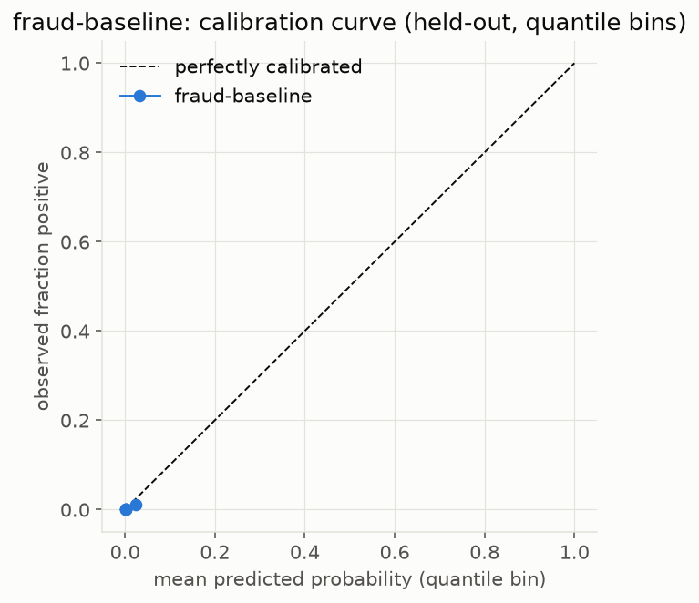
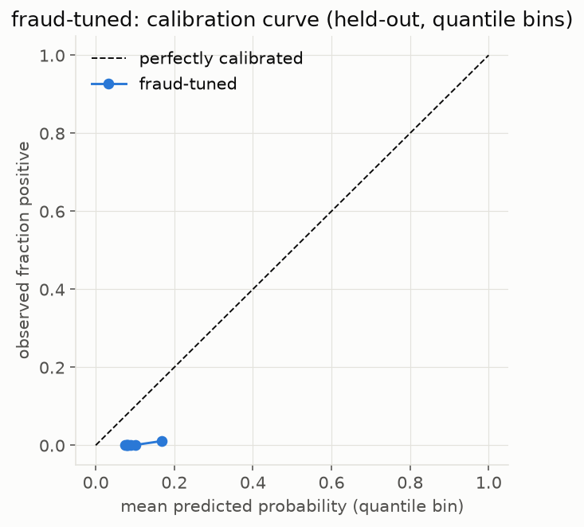
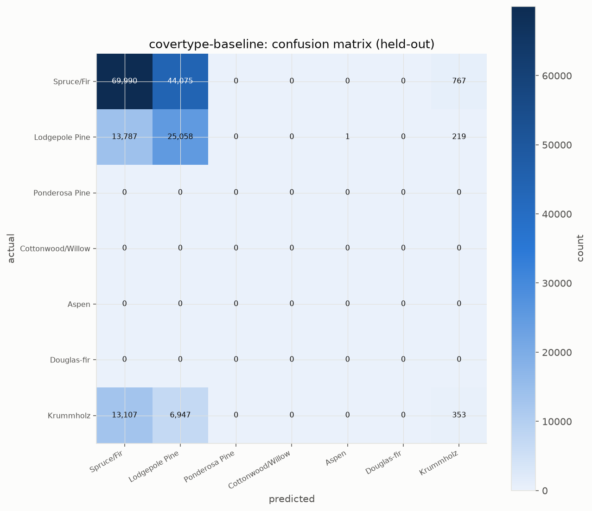
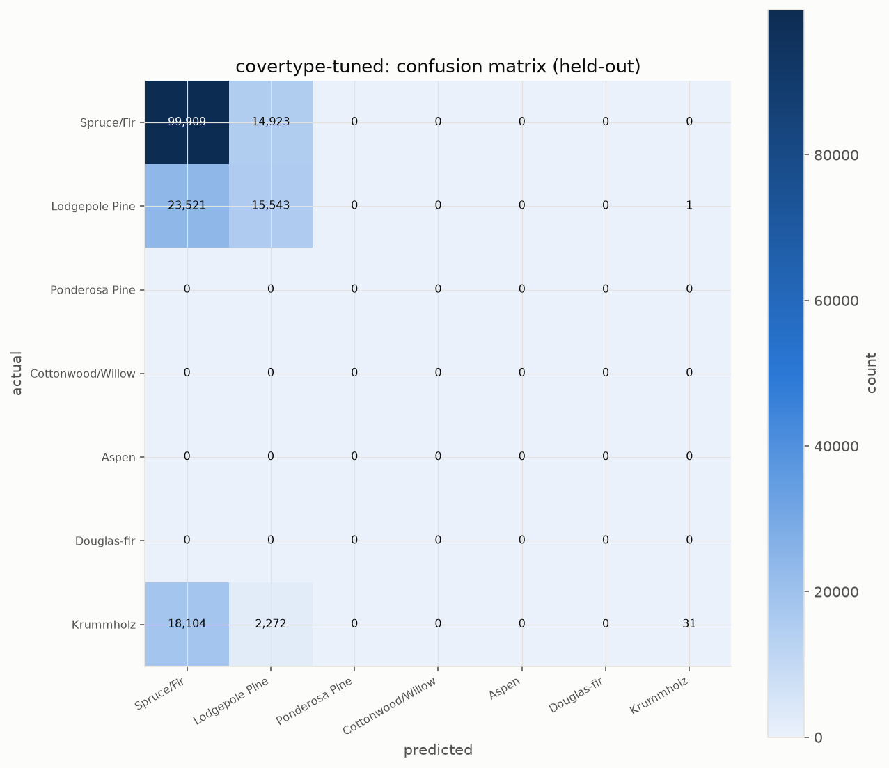
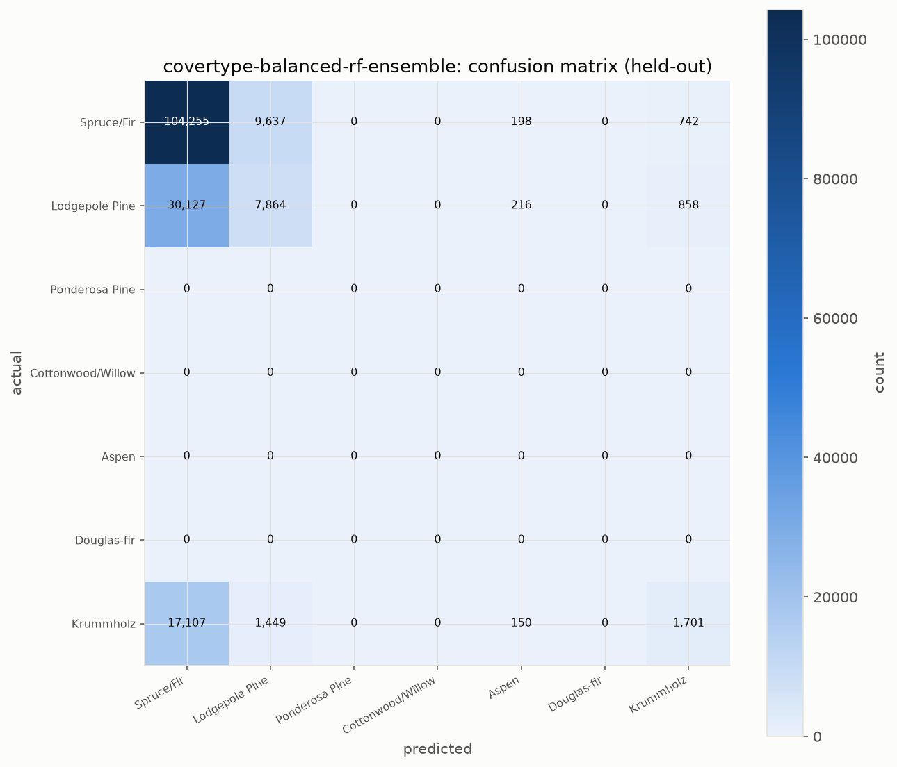

# Improvement-experiment history

Three stages of investigating and improving the two weakest-scoring models from the live-test
statistics pass (`fraud` and `covertype` — see the main [README](../README.md) and
[docs/RESEARCH-NOTES.md](../docs/RESEARCH-NOTES.md)). Each stage's code is preserved unmodified:
[`improve_legacy.py`](improve_legacy.py) (stage 1), [`improve_legacy2.py`](improve_legacy2.py)
(stage 2), [`improve_current.py`](improve_current.py) (stage 3, current). None of the three
touches the original live-test trainers — every number here is a separate benchmarking experiment,
not a change to the deployed pipeline.

## Stage 1 (`improve_legacy.py`) — hyperparameter tuning + class weighting

**Fraud**: `class_weight="balanced"` + a validated `max_depth` sweep (time-forward
train/validation/test, validation carved from the end of the train window only).

| Metric | Baseline | Tuned |
|---|---|---|
| Test AUPRC | 0.3920 | **0.7203** |
| ECE | 0.0019 | 0.0896 (47x worse) |
| Brier score | 0.0012 | 0.0096 (8x worse) |

| Baseline calibration | Tuned calibration |
|---|---|
|  |  |

A real, large AUPRC gain, at a real, disclosed calibration cost (Liu et al. 2026's exact predicted
tradeoff for resampling/reweighting under severe imbalance — cited in RESEARCH-NOTES.md).

**Covertype**: same `class_weight="balanced"` approach, `max_depth` validated the same way.

| Metric | Baseline | Tuned |
|---|---|---|
| Test macro-F1 | 0.2822 | **0.4051** |
| Krummholz recall | 0.0173 | 0.0015 (worse) |
| Krummholz precision | 0.264 | 0.969 |

| Baseline confusion matrix | Tuned confusion matrix |
|---|---|
|  |  |

The aggregate metric improved by getting better at the classes with full train/test elevation
overlap — Krummholz (zero overlap between its 103 training rows and 20,407 test rows) got *worse*,
not better, as the model became more conservative overall.

## Stage 2 (`improve_legacy2.py`) — ensemble resampling (CLIMB-inspired)

CLIMB (arXiv:2505.17451, NeurIPS 2025) shows ensemble-resampling methods sometimes beat plain
gradient boosting by large margins on hard multiclass problems, via a different mechanism than
class weighting (each tree's bootstrap sample is itself rebalanced). Tested
`imblearn.ensemble.BalancedRandomForestClassifier` on Covertype:

| Metric | Baseline | Tuned (stage 1) | Balanced-RF ensemble |
|---|---|---|---|
| Test macro-F1 | 0.2822 | 0.4051 | 0.2994 |
| Krummholz recall | 0.0173 | 0.0015 | **0.0834** |
| Krummholz F1 | 0.032 | 0.003 | **0.143** |

The first method that made real progress on Krummholz specifically — a genuine tradeoff against
stage 1's aggregate-optimizing result, not a strict improvement on it.

## Stage 3 (`improve_current.py`) — Britsch-inspired binary reduction + weight sweep

Britsch, Gagunashvili & Schmelling (arXiv:1011.6224) is the one paper confirmed to use the real
UCI Covertype dataset (Cottonwood/Willow as a binary "signal" class). Their central technique
(more majority data + SMOTE, under a random split) doesn't transfer — their paper explicitly
assumes full train/test feature overlap, which Krummholz does not have. Two structural ideas *do*
transfer: collapsing to one-vs-rest binary (concentrating model capacity), and scanning a cost/
weight parameter to trace a full precision/recall frontier rather than trusting one heuristic
choice.

| Weight | HGB recall | HGB precision | HGB F1 |
|---|---|---|---|
| 1 | 0.065 | 0.310 | 0.108 |
| 5 | 0.015 | 0.236 | 0.029 |
| **20** | **0.135** | **0.451** | **0.208** |
| 100 | 0.0005 | 0.588 | 0.001 |
| 300 | 0.001 | 0.647 | 0.001 |
| 564 (`class_weight="balanced"`'s own ratio) | 0.0017 | 0.630 | 0.003 |
| 1000 | 0.0021 | 0.538 | 0.004 |

The same sweep, run against `BalancedRandomForestClassifier` (stage 2's bagging/undersampling
mechanism) instead of `HistGradientBoosting`, on the same binary Krummholz-vs-rest reduction:

| Weight | BalancedRF recall | BalancedRF precision | BalancedRF F1 |
|---|---|---|---|
| **1** | **0.083** | 0.434 | 0.139 |
| 5 | 0.053 | 0.796 | 0.100 |
| 20 | 0.020 | 0.930 | 0.038 |
| 100 | 0.006 | 0.962 | 0.012 |
| 300 | 0.004 | 1.000 | 0.008 |
| 564 | 0.001 | 1.000 | 0.003 |
| 1000 | 0.002 | 1.000 | 0.004 |

**The best Krummholz result across every method tried** — 7.8x the baseline recall — found only
by sweeping the weight parameter rather than using `class_weight="balanced"` directly, which lands
at one of the *worst* points in the same sweep. That win is specific to the boosting mechanism:
BalancedRF's own best recall under the same binary reduction (0.083 at w=1) exactly ties its
*multiclass* ensemble recall already reported in stage 2 (0.0834) — i.e. binary reduction did
nothing for the bagging/undersampling mechanism, and increasing BalancedRF's weight only drove its
precision toward 1.000 while collapsing recall toward zero. Capacity concentration via binary
reduction helped boosting specifically, not resampling-based bagging in general. Full sweep data
(both families, 7 weights each, val + test splits) is `../krummholz_binary_sweep.json` (raw JSON,
not curated); see [docs/RESEARCH-NOTES.md](../docs/RESEARCH-NOTES.md) for the honest caveat that
validation-based weight selection is itself uninformative for this class (the val window recreates
the same zero-overlap problem one level down between train and validation).

## Summary: what actually worked

| Problem | What helped | What didn't |
|---|---|---|
| Fraud AUPRC | Class weighting + tuning (+84% relative) | — |
| Fraud calibration | — | Class weighting (47x worse ECE, a real cost of the AUPRC gain) |
| Covertype aggregate macro-F1 | Class weighting + tuning (+43% relative) | — |
| Covertype Krummholz recall specifically | Binary reduction + swept weight (+680% relative) | Multiclass class weighting (made it worse); ensemble resampling alone (smaller gain); `class_weight="balanced"` as a single heuristic (one of the worst points in the sweep) |
